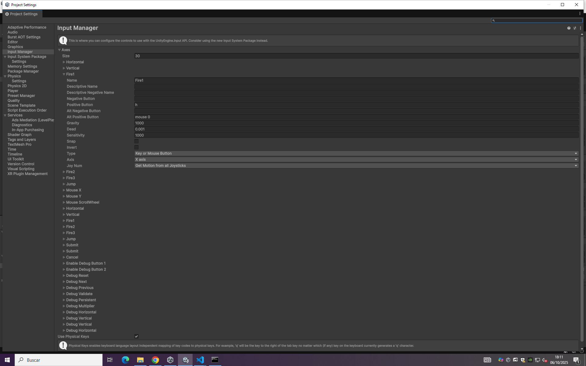
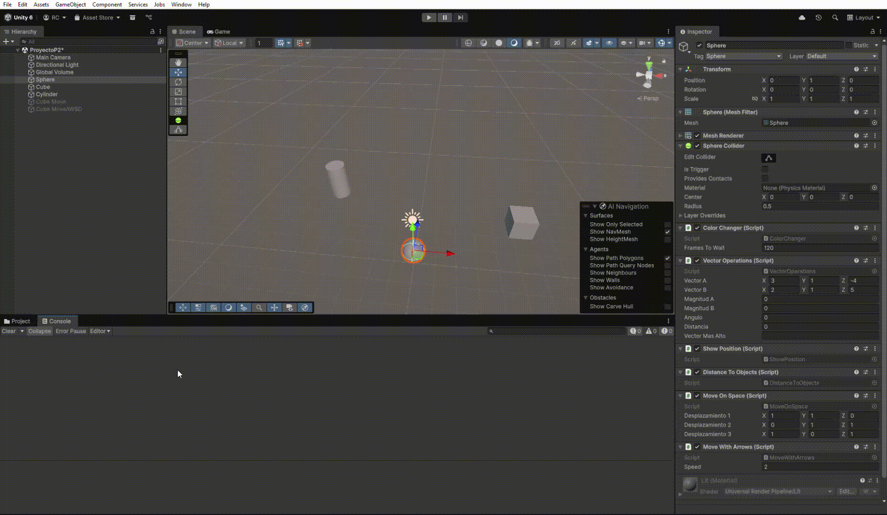

# Práctica 2 - Ejercicios de Movimiento en Unity

## Introducción
En esta práctica se han desarrollado diferentes scripts en C# para Unity, cada uno asociado a un ejercicio de movimiento y manipulación de objetos en una escena 3D. Los ejercicios cubren desde el manejo de colores, vectores y posiciones, hasta el control de movimiento mediante teclado y la interacción entre objetos. Cada script está asociado a un GameObject y parametrizado para ser fácilmente configurable desde el inspector de Unity.

---

## Ejercicio 1
### Código (`ColorChanger.cs`)
```csharp
using UnityEngine;

public class ColorChanger : MonoBehaviour
{
  public int framesToWait = 120;
  private int frameCounter = 0;
  private Vector4 vecColor;

  void Start()
  {
    this.vecColor = new Vector4(Random.value, Random.value, Random.value, 1.0f);
    GetComponent<Renderer>().material.color = vecColor;
  }

  void Update()
  {
    frameCounter++;
    if (frameCounter >= framesToWait)
    {
      int index = Random.Range(0, 3);
      vecColor[index] = Random.value;
      GetComponent<Renderer>().material.color = vecColor;
      frameCounter = 0;
    }
  }
}
```
**Descripción:**
Inicializa un color aleatorio y cada cierto número de frames cambia un componente aleatorio del color del objeto. El número de frames es configurable desde el inspector.

---

## Ejercicio 2
### Código (`VectorOperations.cs`)
```csharp
using UnityEngine;

public class VectorOperations : MonoBehaviour
{
  public Vector3 vectorA;
  public Vector3 vectorB;
  
  public float magnitudA;
  public float magnitudB;
  public float angulo;
  public float distancia;
  public string vectorMasAlto;

  void Start()
  {
    this.magnitudA = vectorA.magnitude;
    this.magnitudB = vectorB.magnitude;
    this.angulo = Vector3.Angle(vectorA, vectorB);
    this.distancia = Vector3.Distance(vectorA, vectorB);
    this.vectorMasAlto = vectorA.y > vectorB.y ? "VectorA más alto" : (vectorA.y < vectorB.y ? "VectorB más alto" : "Misma altura");
    DrawResults();
  }

  private void DrawResults()
  {
    Debug.Log($"Magnitud A: {this.magnitudA}");
    Debug.Log($"Magnitud B: {this.magnitudB}");
    Debug.Log($"Ángulo: {this.angulo}");
    Debug.Log($"Distancia: {this.distancia}");
    Debug.Log(this.vectorMasAlto);
  }
}
```
**Descripción:**
Calcula y muestra en consola la magnitud, ángulo, distancia y altura relativa de dos vectores configurables desde el inspector. Los resultados también se muestran en el inspector.

---

## Ejercicio 3
### Código (`ShowPosition.cs`)
```csharp
using UnityEngine;

public class ShowPosition : MonoBehaviour
{
  void OnGUI()
  {
    Vector3 pos = GetComponent<Transform>().position;
    GUI.Label(new Rect(10, 10, 300, 20), $"Posición: {pos}");
  }
}
```
**Descripción:**
Muestra en pantalla la posición actual de la esfera usando la propiedad `transform.position`.

---

## Ejercicio 4
### Código (`DistanceToObjects.cs`)
```csharp
using UnityEngine;

public class DistanceToObjects : MonoBehaviour
{
  void Start()
  {
    GameObject cubo = GameObject.FindWithTag("Cube");
    GameObject cilindro = GameObject.FindWithTag("Cylinder");
    float distCubo = Vector3.Distance(transform.position, cubo.transform.position);
    float distCilindro = Vector3.Distance(transform.position, cilindro.transform.position);
    Debug.Log($"Distancia a cubo: {distCubo}");
    Debug.Log($"Distancia a cilindro: {distCilindro}");
  }
}
```
**Descripción:**
Muestra en consola la distancia desde la esfera a otros objetos (cubo y cilindro) usando sus etiquetas.

---

## Ejercicio 5
### Código (`MoveOnSpace.cs`)
```csharp
using UnityEngine;

public class MoveOnSpace : MonoBehaviour
{
  public Vector3 desplazamiento1;
  public Vector3 desplazamiento2;
  public Vector3 desplazamiento3;  
  private Vector3 posicionOriginal;
  private int indice = 0; 
   
  void Start()
  {
    posicionOriginal = transform.position;
  }  
  void Update()
  {
    if (Input.GetKeyDown(KeyCode.Space))
    {
      Vector3[] desplazamientos = { desplazamiento1, desplazamiento2, desplazamiento3 };
      transform.position = posicionOriginal + desplazamientos[indice];
      indice = (indice + 1) % desplazamientos.Length; 
    }
  }
}
```
**Descripción:**
Permite mover un objeto a tres posiciones configuradas (desplazamientos) al pulsar la barra espaciadora, alternando entre ellas.

---

## Ejercicio 6
### Código (`ShowSpeedOnArrow.cs`)
```csharp
using UnityEngine;

public class ShowSpeedOnArrow : MonoBehaviour
{
  public float velocidad = 1f;  

  void Update()
  {
    float vertical = Input.GetAxis("Vertical");
    float horizontal = Input.GetAxis("Horizontal");
    if (Input.GetKeyUp(KeyCode.UpArrow))
      Debug.Log($"Arriba: {velocidad * vertical}");
    if (Input.GetKeyUp(KeyCode.DownArrow))
      Debug.Log($"Abajo: {velocidad * vertical}");
    if (Input.GetKeyUp(KeyCode.LeftArrow))
      Debug.Log($"Izquierda: {velocidad * horizontal}");
    if (Input.GetKeyUp(KeyCode.RightArrow))
      Debug.Log($"Derecha: {velocidad * horizontal}");
  }
}
```
**Descripción:**
Muestra en consola el resultado de multiplicar la velocidad por el valor de los ejes horizontal y vertical cada vez que se pulsan las flechas.

---

## Ejercicio 7
### Configuración del Input Manager


**Descripción:**
Mapea la tecla H a la función de disparo usando el Input Manager. (No hay script asociado, se configura en el Input Manager y se puede usar `Input.GetButtonDown("Fire1")` en un script de disparo.)

---

## Ejercicio 8
### Código (`MoveCube.cs`)
```csharp
using UnityEngine;

public class MoveCube : MonoBehaviour
{
  public Vector3 moveDirection = Vector3.right;
  public float speed = 2f;

  void Start()
  {
    Vector3 pos = transform.position;
    pos.y = 0;
    transform.position = pos;
  }  

  void Update()
  {
    transform.Translate(moveDirection * speed, Space.World);
  }
}
```
**Descripción:**
Traslada el cubo en la dirección y velocidad configuradas, usando `Translate`.

- Si duplicas las coordenadas de la dirección del movimiento, el cubo se moverá el doble de rápido en esa dirección.
- Si duplicas la velocidad manteniendo la dirección, el cubo también se moverá el doble de rápido.
- Si la velocidad es menor que 1, el cubo se moverá más lento.
- Si la posición inicial del cubo tiene y > 0, el cubo se recoloca a y = 0 en el Start.
- Si cambias `Space.World` por `Space.Self`, el movimiento será relativo a la rotación del cubo (eje local).

---

## Ejercicio 9 y 10
### Código (`MoveWithArrows.cs`)
```csharp
using UnityEngine;

public class MoveWithArrows : MonoBehaviour
{
  public float speed = 2f;
  
  void Update()
  {
    float moveX = 0f, moveY = 0f;
    if (Input.GetKey(KeyCode.W)) moveY = 1f;
    if (Input.GetKey(KeyCode.S)) moveY = -1f;
    if (Input.GetKey(KeyCode.A)) moveX = -1f;
    if (Input.GetKey(KeyCode.D)) moveX = 1f;
    Vector3 move = new Vector3(moveX, moveY, 0) * speed * Time.deltaTime;
    Vector3 nuevaPos = transform.position + move;
    nuevaPos.z = transform.position.z;
    transform.position = nuevaPos;
  }
}
```
**Descripción:**
Permite mover el objeto con las teclas WASD en los ejes X e Y, manteniendo la Z constante. Para el ejercicio 10, se añadió el factor `Time.deltaTime` lo que hizo que el movimiento se viese fluido y no desapareciera de la escena. El cambio respecto al 9 es la multiplicación por `Time.deltaTime` en el vector de movimiento.

---

## Ejercicio 11
### Código (`MoveCubeToSphere.cs`)
```csharp
using UnityEngine;

public class MoveCubeToSphere : MonoBehaviour
{
    public Transform esfera;
    public float speed = 2f;

    void Update()
    {
      if (esfera == null) return;
      Vector3 target = esfera.position;
      target.y = transform.position.y; 
      Vector3 direction = (target - transform.position).normalized;
      transform.Translate(direction * speed * Time.deltaTime);
    }
}
```
**Descripción:**
El cubo se mueve en línea recta hacia la posición de la esfera, manteniendo su altura constante y usando un vector normalizado para que la velocidad sea constante.

---

## Ejercicio 12
### Código (`CubeLookAtSphere.cs`)
```csharp
using UnityEngine;

public class CubeLookAtSphere : MonoBehaviour
{
  public Transform esfera;
  public float speed = 2f;  
  
  void Update()
  {
    if (esfera == null) return;
    Vector3 lookTarget = esfera.position;
    lookTarget.y = transform.position.y;
    transform.LookAt(lookTarget);
    transform.Translate(Vector3.forward * speed * Time.deltaTime, Space.Self);
  }
}
```
**Descripción:**
El cubo gira para mirar siempre hacia la esfera y avanza en la dirección de su eje Z positivo (hacia adelante), sin inclinarse.

---

## Ejercicio 13
### Código (`ForwardWithHorizontal.cs`)
```csharp
using UnityEngine;

public class ForwardWithHorizontal : MonoBehaviour
{
  public float speed = 2f;
  public float rotationSpeed = 100f;
  
  void Update()
  {
    float horizontal = Input.GetAxis("Horizontal");
    transform.Rotate(0, horizontal * rotationSpeed * Time.deltaTime, 0);
    transform.Translate(Vector3.forward * speed * Time.deltaTime, Space.Self);
  }
}
```
**Descripción:**
Utiliza el eje Horizontal para girar el objeto y avanza siempre en la dirección hacia adelante (`transform.forward`).

---

## Resultados visuales

### Ejercicios 1-6: Comportamientos básicos


Este GIF muestra los ejercicios del 1 al 6 en acción:
- **Ejercicio 1**: Se ve como cambia la esfera de color cada 120 frams como esta configurado en el inspector.
- **Ejercicio 2**: Operaciones con vectores ya introduciodes en el inspector, resultados mostrados en consola.
- **Ejercicio 3**: Visualización de la posición de la esfera en pantalla, en la zona arriba izquierda.
- **Ejercicio 4**: el calculo de la sdistancias entre elementos de la escena mostrado en consola.
- **Ejercicio 5**: Cambio de posición con la barra espaciadora, desplazamiento puesto en el inspector.
- **Ejercicio 6**: Detección de pulsaciones de flechas y cálculo de velocidad, con velocidd modificada.

### Ejercicios 8-13: Movimiento avanzado


Este GIF muestra los ejercicios del 8 al 13 en acción:
- **Ejercicio 8**: Movimiento del cubo rojo hacia la derecha(va rapido porque no tiene Time.deltaTime)
- **Ejercicio 9 y 10**: Control de movimiento con WASD en la esfera directamente usando Time.deltaTime.
- **Ejercicio 11 y 12**: El cubo azul mira hacia la esfera mientras avanza hacia esta
- **Ejercicio 13**: Control de rotación con eje horizontal y avance hacia adelante del cubo azul en la segunda ejecución del juego.
